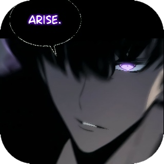

<!-- HEADER -->

    

    
    
    
    

<h2 align="center">Hi 👋, I'm Sean Charles Pugosa</h2>
<h3 align="center">
    Lead Developer, CEO of InnovatechPH. A very experienced full-stack developer, a tech-savvy with a passion for crafting innovative solutions, IOT, digital and physical technology. With a 10-year journey in the world of computers, I have honed my skills and obtained valuable knowledge that I use to help and influence others.
    

* DUE TO CONTRACT RESTRICTIONS,  MOST OF MY REPOSITIORIES ARE SET TO PRIVATE *
  
</h3>

 

<!-- EXPERIENCE -->
<h2 align="center">🌟 Stack Experience 💯</h2>

<!-- EXTRAS -->

 

    

<h2 align="center">📉 GitHub Stats</h2>

     
    
    

 

<h1 align='center'>PERSONAL SPACE</h1>

 

 
 
  
- A Full-Stack developer, coding the shadows that dwell between  digital dimensions
- Two decades of existence, drawn into the mystic of code
- Code flows through my veins—PHP, Python, SQL—each line a thread in the fabric of creation.
- There is limitless power in the digital void, where boundaries shatter and reality fades.
- An insatiable hunger for the unknown—machine learning, and intelligence stirs in the void.

 

 
 
  
- 🌐 [***Facebook Account***](https://fb.com/scvpfb)  
- 💼 [***Company Site***](https://innovatechservicesph.com/landing)  
- 📊 [***Company Dashboard***](https://innovatechservicesph.com)  
- 🔧 [***Admin Site***](https://innovatechservicesph.com/admin)  
- 💻 [***React Portfolio***](https://www.scvp.online/react)  
 

 

 *“The codebase fears me more than the developers do” – Code Overlord* 
